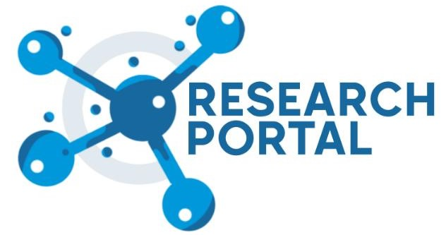

<!-- PROJECT SHIELDS -->

&nbsp;&nbsp;&nbsp;&nbsp;

&nbsp;&nbsp;&nbsp;&nbsp;

&nbsp;&nbsp;&nbsp;&nbsp;

&nbsp;&nbsp;&nbsp;&nbsp;


# Research Portal Backend
<!-- PROJECT LOGO -->
<br />
<p align="center">
  
</p>

<!-- TABLE OF CONTENTS -->
<details open="open">
  <summary>Table of Contents</summary>
  <ol>
    <li>
      <a href="#walkthrough-of-the-research-portal">Walkthrough of the Research Portal</a>
      <ul>
        <li><a href="#problems-faced-by-research-aspirants">Problems faced by research aspirants</a></li>
        <li><a href="#solution">Solution</a></li>
        <li><a href="#hierarchy">Hierarchy</a></li>
        <li><a href="#benefits">Benefits</a></li>
        <li><a href="#built-with">Built With</a></li>
      </ul>
    </li>
    <li>
      <a href="#getting-started">Getting Started</a>
      <ul>
        <li><a href="#installation">Installation</a></li>
        <li><a href="#setup-guidelines">Setup Guidelines</a></li>
      </ul>
    </li>
    <li><a href="#how-to-contribute">How to Contribute</a></li>
    <li><a href="#contacts">Contacts</a></li>
    <li><a href="#contributors">Contributors</a></li>
  </ol>
</details>

<br>

<!-- Walkthrough -->
## Walkthrough of the Research portal
<br>

We often see that students tend to give up easily on research work and students with high aspirations shift to other fields of industry experience.

### Problems faced by research aspirants :
* The process of getting a research project can be very tedious and most students find it difficult.
* People interested in core have to wait until 2nd or 3rd year to know interesting topics in their domain
* Most of the 1st and 2nd year students don’t even know about the exact process of applying for research projects

### Solution :
By providing the students with a laid-out path to overcome this intensive and difficult process the solution is to make a Research Portal.
<br>
With this Research Portal, students won’t need to search for projects anymore and can easily find and apply to projects of their interest. In the Research portal a faculty can post for projects they are currently working on and might need assistance . These projects will then appear in the students feed. Interested students can then apply for them and the faculty can select them depending on their skill levels
<br>

### Hierarchy :

There are 2 user groups: student and teacher

#### Signup/login:
Signup and update your account with necessary details like name, department, work email, phone number, etc. An email verification will be sent to the email id provided.
Institute email id is necessary for verification as groups are auto-assigned based on that.

#### Projects feed:
Active projects by teachers will be shown here.Upload your grades and necessary documents for the project you like and wait to be shortlisted.

### Benefits :

> * Finding Research Projects made easier and much faster.
> * Research projects posted throughout the year.
> * Enhancing the CV of students by participating in research projects.

<!--Frameworks used-->
### Built With:
> Django <br>
> Django Rest Framework

<br>

<!-- GETTING STARTED -->
## Getting Started

<!--Installation-->
### Installation:
### For Windows

Add the following to requirements.txt (only for windows)
```
pip install python-magic-bin
```
### For Linux/Debian
```
sudo apt-get install libmagic1
```


Install virtualenvironment (if not already)
```
pip install virtualenv
virtualenv myenv
```

Activate virtualenv
```
myenv\scripts\activate
```

> PS : Linux Users follow different guidelines 
> For further details refer <a href="https://www.geeksforgeeks.org/creating-python-virtual-environment-windows-linux/">https://www.geeksforgeeks.org/creating-python-virtual-environment-windows-linux/</a>


Django Installation ( Developer Mode )
```
pip install -r requirements.txt
python local.py makemigrations
python local.py migrate
python local.py runserver
```

<!--Setup-->
### Setup Guidelines:
- After sucessfull installation create a .env in the directory where settings.py is located 
- It must have the content as follows :
```
SECRET_KEY=
DEBUG=True
EMAIL_HOST_USER=
PASSWORD=
```


> Navigate to localhost:8000 to see the magic <br>
> PS 2: For more details refer to this tutorial <a href="https://simpleisbetterthancomplex.com/series/2017/09/04/a-complete-beginners-guide-to-django-part-1.html"> Tutorial </a> <br>

<br>

<!--Contribution Guidelines-->
## Contribution Guidelines 

Before making a migration run 
```
python local.py makemigrations --dry-run --verbosity 3
```
to make sure if it breaks any thing

- Fork this Repo
- Create a branch in the forked repo 
```
git checkout -b develop
```
- Make Changes 
- Push to your repo & make a pull request

> PS 3 : Instructions to update git forked repo <a href="https://medium.com/@topspinj/how-to-git-rebase-into-a-forked-repo-c9f05e821c8a"> Medium </a>

<br>

<!--Contacts-->
## Contacts
<br>

> Website : &nbsp;&nbsp;&nbsp; <a href="https://www.ieeesbnitdgp.com/"> https://www.ieeesbnitdgp.com/</a><br>
>Github :  &nbsp;&nbsp;&nbsp;&nbsp;&nbsp; <a href="https://github.com/ieeesb-nitdgp">https://github.com/ieeesb-nitdgp</a>

<br>

<!--Rp backend Contributors-->
## Contributors

<table>
<tr>
<td align="center"><br /><sub><a href="https://github.com/sa-y-an"><b>Sayan Mondal</b></a></sub></td>
<td align="center"><br /><sub><a href="https://github.com/arin17bishwa"><b>Bishwajit Ghosh</b></a></sub></td>
<td align="center"><br /><sub><a href="https://github.com/durbar2003"><b>Durbar Chakrabarty</b></a></sub></td>
<td align="center"><br /><sub><a href="https://github.com/Sreemoyee26"><b>Sreemoyee Sadhukhan</b></a></sub></td>
<td align="center"><br /><sub><a href="https://github.com/NaveenS143"><b>Naveen Leo</b></a></sub></td>
</tr>
</table>

<br>

> For any suggestions, create an issue or start a discussion in the discussion tab.

