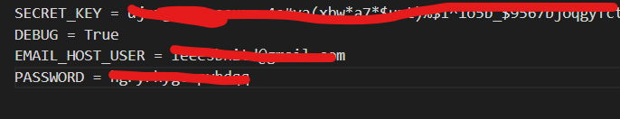
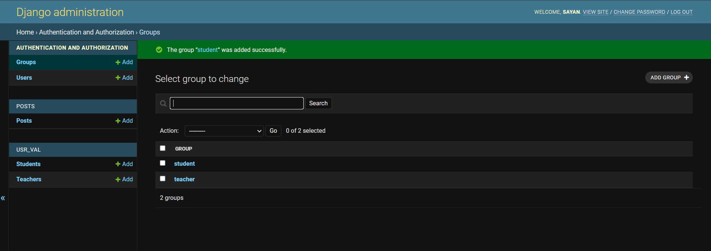

# RP draft

## Setup Guidelines 
- After sucessfull installation create a .env in the directory where settings.py is located 
- It must have the content as follows 


- Create two groups (student and teacher) from the admin panel or shell 



## Installation Guidelines


### For Windows

Install virtualenvironment (if not already)
```
pip install virtualenv
virtualenv myenv
```

Activate virtualenv
```
myenv/scripts/activate
```

> PS : Linux Users follow different guidelines 
> For further details refer <a href="https://www.geeksforgeeks.org/creating-python-virtual-environment-windows-linux/">https://www.geeksforgeeks.org/creating-python-virtual-environment-windows-linux/</a>


Django Installation ( Developer Mode )
```
pip install -r requirements.txt
python local.py makemigrations
python local.py migrate
python local.py runserver
```

- Follow the setup guidelines above after this.

> Navigate to localhost:8000 to see the magic <br>
> PS 2: For more details refer to this tutorial <a href="https://simpleisbetterthancomplex.com/series/2017/09/04/a-complete-beginners-guide-to-django-part-1.html"> Tutorial </a> <br>

## Contribution Guidelines 

- Fork this Repo
- Create a branch in the forked repo 
```
git branch develop
git checkout develop
```
- Make Changes 
- Push to your repo & make a pull request

> PS 3 : Instructions to update git forked repo <a href="https://medium.com/@topspinj/how-to-git-rebase-into-a-forked-repo-c9f05e821c8a"> Medium </a>
